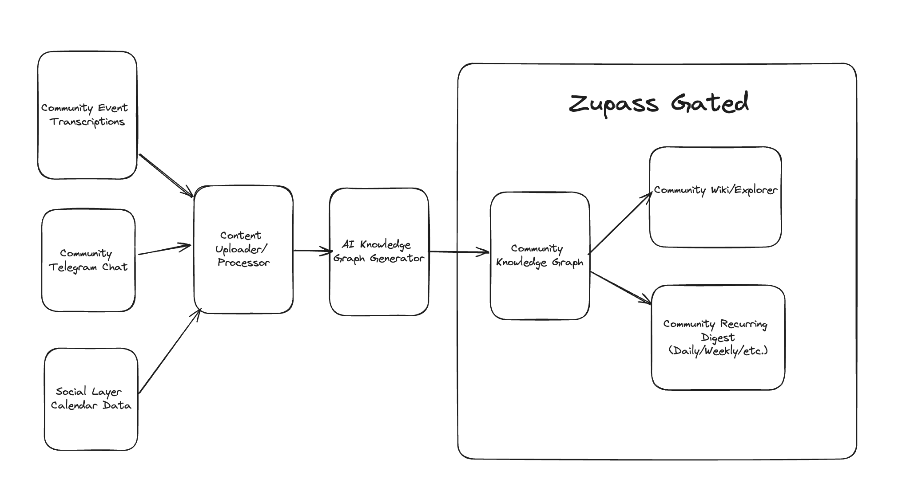

# Community Wiki Tool

## Description
The Community Wiki Tool is an innovative system designed to transform diverse community-generated content into a structured, explorable knowledge base. This tool processes data from various sources, uses AutoGraph to generate a comprehensive knowledge graph, and provides multiple ways for community members to interact with and benefit from the collective knowledge.



## Installation
```
git submodule init
git submodule update
cd quartz
bun i
```

## Key Components

### Input Sources
- Community Event Transcriptions
- Community Telegram Chat
- Social Layer Calendar Data

### Processing Pipeline
1. **Content Uploader/Processor**: Aggregates and preprocesses data from all input sources.
2. **AutoGraph**: Employs TinyCloud's [AutoGraph](https://gbafa.com/posts/autograph/) to create a structured knowledge graph from the processed content.
3. **Community Knowledge Graph**: The central repository of organized, interconnected community knowledge.

### Output Interfaces
- **Community Wiki/Explorer**: An interactive interface for exploring the knowledge graph.
- **Community Recurring Digest**: Regular summaries (daily/weekly/etc.) of new and important information.

Note: These outputs are gated through Zupass, ensuring access control and community privacy.

## Key Features
- Processes diverse types of community-generated content
- Uses AutoGraph to infer structures and connections between concepts
- Organizes information into an explorable knowledge graph
- Provides multiple ways to access and benefit from collective knowledge
- Generates regular digests to keep community members informed
- Gated access through Zupass for community privacy

## Technologies Used
- AutoGraph: An AI-powered knowledge graph generator that uses an LLM (Large Language Model) pipeline for data sorting and structuring
- Zupass: For gating access to the output interfaces

## Usage
*[This section will be expanded as the tool development progresses]*

## How It Works
1. **Input**: The tool ingests data from community event transcriptions, Telegram chats, and social calendar events.
2. **Processing**: The Content Uploader/Processor aggregates and prepares the data for analysis.
3. **AutoGraph Knowledge Graph Generation**: AutoGraph creates a structured representation of the community's collective knowledge.
4. **Output**: The system provides:
   - A comprehensive Community Knowledge Graph
   - An interactive Wiki/Explorer interface for navigation
   - Regular digests summarizing key information
   All outputs are accessible through Zupass-gated interfaces.

## Current Status
This project is currently in development. Installation instructions and detailed usage guidelines will be provided as the project progresses.